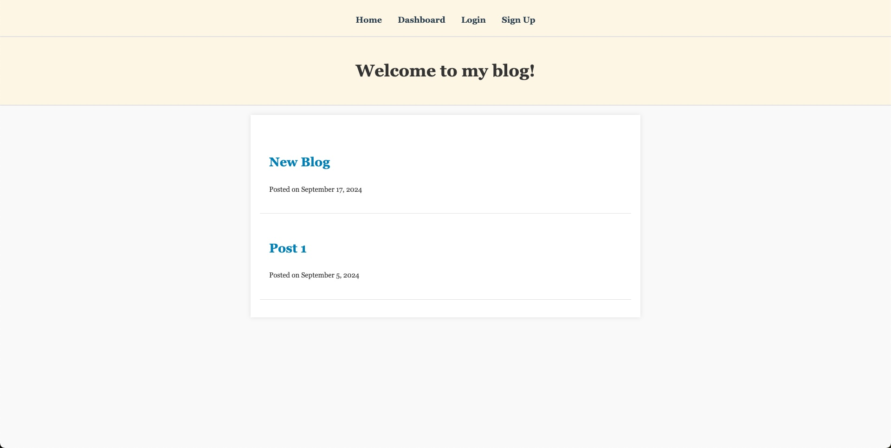

# my-mvc-tech-blog

## Description

A CMS-style blog site built from scratch and deployed on Render, where developers can publish their blog posts and comment on other developers' posts. This app follows the MVC paradigm in its architectural structure, using Handlebar.js as the templating language, Sequelize as the ORM, and the express-session npm package for authentication. 

## Table of Contents
        
- [Installation](#installation)
- [Usage](#usage)
- [Credits](#credits)
- [License](#license)

## Installation

This project used various npm packages to achieve its functionality. They include express-handlebars, pg, Sequelize, Express.js,
dotenv, bcrypt, express-session, and connect-session-sequelize.

## Usage
        
This application is deployed using Render, to use it you can go to the following link: 

## Credits
        
GitHub: https://github.com/RickHennessey87
Email: pjhennessey89@gmail.com

## License
    
This project is covered by the MIT License license.

[MIT License](https://opensource.org/licenses/MIT)
